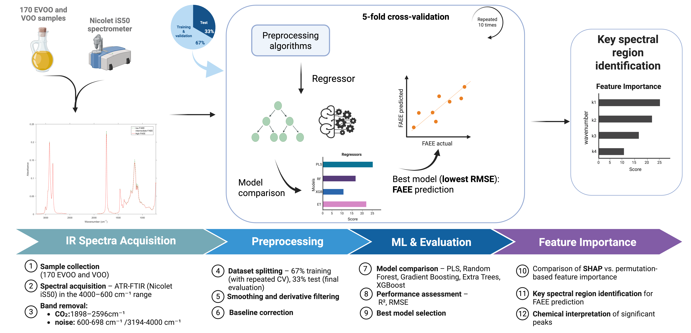

# Predicting Ethyl Esters in Extra Virgin Olive oils

## 📄 Paper Information

**Title:** Unlocking Extra Virgin Olive Oil Identification: Predicting Ethyl Esters with Explainable AI on IR Spectra 
**Authors:** Michele Magarelli, Silvia Grassi, Giacomo Squeo, Pierfrancesco Novielli, Roberto Bellotti, Francesco Caponio, Cristina Alamprese and Sabina Tangaro  
**Journal:** *Food Chemistry*, Volume 498, Part 1, 147013 
**DOI:** https://doi.org/10.1016/j.foodchem.2025.147013
**Published:** 1 January 2026

---

## 🧠 Project Overview

This study proposes a Machine Learning (ML) and Explainable AI (XAI) framework to predict fatty acid ethyl ester (FAEE) content in extra virgin olive oil (EVOO) using Fourier Transform Infrared (FT-IR) spectroscopy. FAEE are key chemical markers regulated by EU legislation to assess olive oil quality and authenticity.

Unlike traditional laboratory methods (e.g., gas chromatography), this approach provides a rapid, non-destructive, and cost-effective alternative. The integration of XAI techniques enables identification of the most relevant spectral regions driving the predictions, improving interpretability and trust in the model.

Key Features:
	•	Spectral Analysis: Acquisition and preprocessing of FT-IR spectra from olive oil samples.
	•	Multi-Model Comparison: Evaluation of several regression algorithms (PLS, Random Forest, Gradient Boosting, Extra Trees, XGBoost).
	•	Advanced Modeling: Use of ensemble ML methods to capture nonlinear relationships in spectral data.
	•	Explainability: Application of SHAP and feature importance to identify key wavenumbers linked to FAEE content.

---

## ⚙️ Environment Setup

The analysis was conducted using Python 3.11, leveraging libraries such as scikit-learn and PyCaret for model development and optimization.  

--- 

### Methodology Summary

The workflow implemented in the study follows these stages:
	•	Spectral Acquisition & Preprocessing: FT-IR spectra are collected (4000–600 cm⁻¹), with noisy regions removed and optional preprocessing applied (smoothing and first derivative via Savitzky-Golay).  
	•	Dataset Preparation: The dataset (170 samples) is split into training (67%) and test (33%) sets using the Kennard-Stone algorithm to ensure representative distribution.  
	•	Model Selection: Multiple regression models (PLS, RF, GB, ET, XGB) are compared using automated tools (PyCaret), followed by manual fine-tuning.  
	•	Hyperparameter Optimization: RandomizedSearchCV is used to optimize parameters such as learning rate, number of estimators, and tree depth.  
	•	Model Evaluation:
Performance is assessed via:
	•	$R^2$ (coefficient of determination)
	•	RMSE (Root Mean Squared Error)
	•	SMAPE (relative error metric) using repeated cross-validation and independent test set evaluation.  
	•	Best Model: The XGBoost regressor applied to smoothed + first derivative spectra achieved the best performance.  
	•	Interpretation (XAI): SHAP and feature importance analyses identify key spectral regions (e.g., ~1064 cm⁻¹ and 2600–3200 cm⁻¹) associated with FAEE content, linking predictions to chemical structures in the oil.  
